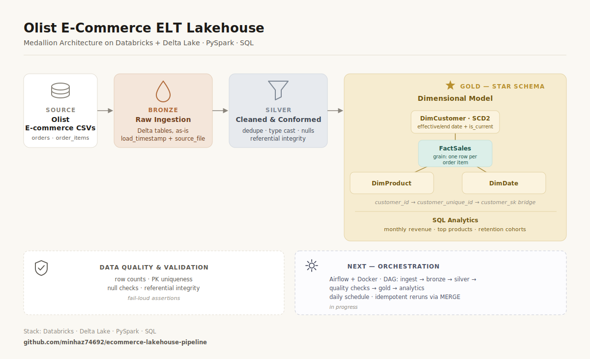

# E-Commerce Lakehouse Pipeline 📊

> An end-to-end **ELT pipeline** on the **medallion architecture** (Bronze → Silver → Gold), built on Databricks + Delta Lake using the public Olist Brazilian e-commerce dataset. Features a Kimball star schema, **SCD Type 2** history tracking, **idempotent MERGE** loads, SQL analytics, and inline data-quality checks.


---

## Overview

This project ingests raw e-commerce data, cleans and conforms it through layered transformations, and models it into an analytics-ready star schema. It's built to demonstrate the core data-engineering loop end to end — **ingest → clean → model → serve** — with production-minded depth on the two pieces that matter most: **slowly changing dimensions (SCD2)** and **idempotent loads via Delta MERGE**.

> ⚠️ **Note:** A portfolio project on the public [Olist dataset](https://www.kaggle.com/datasets/olistbr/brazilian-ecommerce). Built for learning and demonstration, not production use.

---

## Architecture



```
Raw CSVs ──► Bronze ──► Silver ──► Gold (star schema) ──► SQL Analytics
            (raw       (cleaned,   FactSales + Dims        + Data-Quality
             ingest)    deduped)   SCD2 · MERGE            checks
```

**Bronze** — raw Olist CSVs landed into Delta tables *exactly as-is*, with lineage columns (`_load_timestamp`, `_source_file`). Schema-on-read, append-only. No cleaning happens here — this is the reprocessable, auditable copy of the source truth.

**Silver** — cleaned and conformed: deduplicated on primary keys via window functions, type-cast, nulls handled, referential integrity validated. Kept at source grain.

**Gold** — a Kimball dimensional star schema. **FactSales** at one-row-per-order-item grain, surrounded by **DimCustomer** (with SCD Type 2), **DimProduct**, and **DimDate**. Loaded via **idempotent MERGE** so reruns never duplicate.

---

## Tech Stack

| Layer | Tools |
|---|---|
| Processing | PySpark, Databricks |
| Storage | Delta Lake (ACID, time travel, MERGE) |
| Modeling | Kimball star schema, SCD Type 2 |
| Analytics | SQL (CTEs, window functions, cohort logic) |
| Data Quality | Inline `assert`-based checks |
| Language | Python, SQL |

*Scheduling, if run on a recurring basis, is handled by native Databricks Workflows. See [Deferred by Design](#deferred-by-design).*

---

## Business Questions Answered

Three documented SQL analytics run on the Gold layer:

1. **Monthly revenue trend** — product revenue (`SUM(price)`, delivered orders only) by month.
2. **Top products** — highest-revenue products, with units sold, using an aggregate-then-join pattern.
3. **Customer retention cohort** — groups customers by first-purchase month and tracks what percentage return in later months.

**Key finding:** Olist has strikingly low repeat-purchase retention — the large majority of customers buy once and never return, and the rare repeat buyers come back at long, irregular intervals. The cohort model surfaced this directly.

---

## Engineering Decisions

*The reasoning behind the build — the "why," not just the "what." These are the decisions I can defend.*

### Why ELT, not ETL
Raw data lands in Bronze **first**, and all transformation happens in-place on Databricks compute. That's ELT by construction. ETL makes sense when you can't or shouldn't land raw data (e.g. regulated PII that must be stripped before storage, or a rigid target schema that must be conformed to on the way in). For a lakehouse where cheap storage and reprocessability are the point, ELT is the natural fit — and the medallion pattern is inherently ELT.

### Fact grain: one row per order item
The grain of FactSales is deliberately set to the most granular question the pipeline must answer — product-level analytics. One row per *order* would make per-product revenue impossible to attribute, since a single order can contain multiple products at different prices. Atomic grain keeps the fact flexible: you can always aggregate up, never down.

### The per-order vs. per-person key problem (Olist-specific)
Olist issues a **new `customer_id` for every order**, so `customer_id` identifies an *order*, not a person. The stable per-person identity is `customer_unique_id`. This matters twice:
- **SCD2 and retention are built on `customer_unique_id`** — cohorting on `customer_id` would make every customer look like a one-time buyer (their next purchase carries a different `customer_id`), silently zeroing out retention.
- **A bridge connects the two at fact-build time:** `order → customer_id → (lookup via the full silver.customers table) → customer_unique_id → (join DimCustomer) → customer_sk`. The un-deduped `silver.customers` table *is* the bridge; the deduped version is the dimension. This is why Silver keeps `customers` at one-row-per-`customer_id` rather than collapsing it to person.

### SCD Type 2 on DimCustomer
Type 2 preserves point-in-time history: when a customer attribute changes, the old row is expired (`end_date`, `is_current = false`) and a new version is inserted (`effective_date`, `is_current = true`). This lets facts join to the customer version that was valid *when the sale occurred*, instead of overwriting history (Type 1), which would corrupt historical reports. Implemented as an expire-and-insert MERGE using a two-copy staged source. The surrogate key `customer_sk` uses Delta `GENERATED ALWAYS AS IDENTITY`, so new version rows get fresh, stable keys on every run.

### Current-only join on a historical backfill
SCD2 `effective_date` is set at **load time**, not event time. Because this is a one-time historical backfill, all customer versions start at the load date while orders are from 2017–2018 — so a naïve point-in-time join returns null customer keys. Resolved by joining current-version-only: for a historical backfill, each customer has exactly one version, so "current" *is* the correct version. The point-in-time join machinery is retained (commented) for post-go-live changes. Backdating `effective_date` to first-order-date is a documented next-pass improvement.

### Idempotent loads via Delta MERGE
FactSales is loaded with a MERGE upsert keyed on the business grain (`order_id + order_item_id`), not an append. Running the pipeline twice produces identical row counts — the update branch handles existing rows, the insert branch handles new ones. This is what makes the pipeline safe to schedule and rerun without duplicating data, and it demonstrates idempotency without needing an external scheduler.

### Scoping the sales fact
FactSales carries `order_status` as a **degenerate dimension**, and revenue queries filter to `delivered`. This was a deliberate fix after finding canceled-order revenue in the fact — keeping all rows preserves the ability to analyze cancellations and fulfillment, while the filter keeps revenue numbers honest.

---

## Data Quality

Inline `assert`-based checks run against the Silver layer — fail-loud, so a violated invariant stops the run rather than silently corrupting Gold:

- **Row counts > 0** — tables actually loaded
- **Primary-key uniqueness** — including the **composite key** `(order_id, order_item_id)` on order_items
- **No nulls in key columns**
- **Referential integrity** — every `order_id` in order_items exists in orders, verified with a null-safe **left-anti join**

*These are the honest MVP of a data-quality practice. The natural next step is to graduate them to a framework like Great Expectations or a pytest suite with reporting and alerting — same invariants, more robust runner.*

---

## Project Structure

```
ecommerce-lakehouse-pipeline/
├── ingestion/                    # Bronze — raw ingestion
├── transformations/
│   ├── silver/                   # silver_*.py — cleaning & conforming
│   └── gold/                     # dim_date, dim_product,
│                                 #   dim_customer_scd2, fact_sales
├── sql/                          # 3 documented analytics queries
│   ├── monthly_revenue.sql
│   ├── top_products.sql
│   └── customer_retention_cohort.sql
├── tests/                        # data-quality assertions
│   └── test_silver_quality.py
├── docs/                         # architecture diagram, notes
└── README.md
```

> Code files are not Delta tables — the tables live in `bronze`, `silver`, and `gold` schemas in Databricks; the repo holds the transformation logic that produces them.

---

## How to Run

1. **Prerequisites:** a Databricks workspace, the [Olist dataset](https://www.kaggle.com/datasets/olistbr/brazilian-ecommerce) uploaded to a Volume or DBFS path.
2. **Create schemas:** `bronze`, `silver`, `gold`.
3. **Run in order:** ingestion → silver transformations → gold (dimensions first, then FactSales) → data-quality checks → analytics.
4. **Prove idempotency:** re-run the FactSales MERGE cell; row counts stay stable.

---

## Status

- [x] Bronze ingestion with lineage
- [x] Silver cleaning, deduplication & referential integrity
- [x] Gold star schema (FactSales + DimCustomer/DimProduct/DimDate)
- [x] SCD Type 2 on DimCustomer
- [x] Idempotent MERGE loads
- [x] 3 SQL analytics (revenue, top products, retention cohort)
- [x] Inline data-quality checks

---

## Deferred by Design

Airflow, Docker, and a dedicated data-quality framework (Great Expectations) were **deliberately scoped out** — not skipped, deferred. Orchestration schedules and sequences data but adds no transformation logic; for a Databricks-native pipeline, Workflows is the simpler native choice. The priority was a complete, defensible vertical slice over a broad pipeline with shallow pieces. These are later-deepening passes:

- [ ] Databricks Workflow with a daily schedule
- [ ] Great Expectations / pytest data-quality suite
- [ ] Point-in-time SCD2 joins (backdated `effective_date`)

---

## What I Learned

Building this end to end taught me *why* each medallion layer exists, how to model a fact table around a deliberately chosen grain, and how SCD Type 2 preserves point-in-time history. The most valuable lessons came from the dataset's quirks — the per-order-vs-per-person key problem forced me to understand the bridge pattern deeply, and inspecting my own fact table (finding canceled-order revenue, finding retention that looked like zero until I fixed the join key) taught me that verifying data is as much of the job as transforming it.

---

*Built by [Minhazul Islam](http://www.linkedin.com/in/minhaz74692) while transitioning into data engineering.*