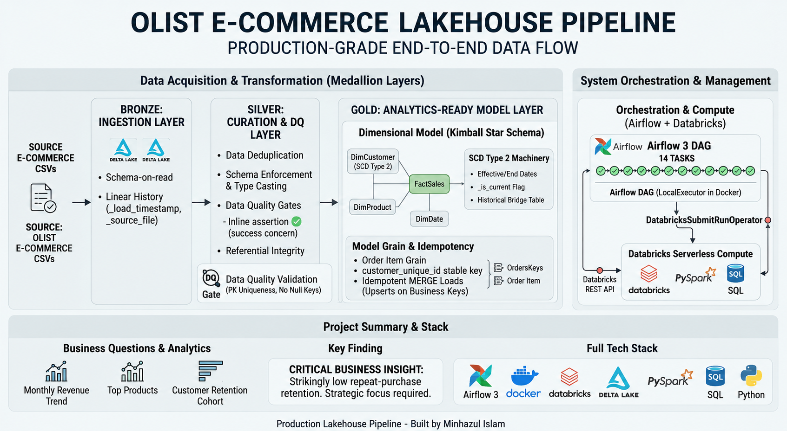

# E-Commerce Lakehouse Pipeline 📊

> An end-to-end **ELT pipeline** on the **medallion architecture** (Bronze → Silver → Gold), built on Databricks + Delta Lake using the public Olist Brazilian e-commerce dataset. Kimball star schema, **SCD Type 2** history tracking, **idempotent MERGE** loads, SQL analytics, and inline data-quality checks.


## Architecture



---

## Overview

Raw Olist CSVs are ingested, cleaned through layered transformations, and modeled into an analytics-ready star schema — with production-minded depth on the two pieces that matter most: **SCD Type 2** dimensions and **idempotent MERGE** loads.

- **Bronze** — raw CSVs landed into Delta as-is, with lineage columns (`_load_timestamp`, `_source_file`). Schema-on-read, append-only.
- **Silver** — deduplicated on primary keys via window functions, type-cast, nulls handled, referential integrity validated.
- **Gold** — Kimball star schema: **FactSales** (grain: one row per order item) + **DimCustomer** (SCD2), **DimProduct**, **DimDate**. Loaded via idempotent MERGE.

> A portfolio project on the public [Olist dataset](https://www.kaggle.com/datasets/olistbr/brazilian-ecommerce), for learning and demonstration.

---

## Tech Stack

**Databricks · Delta Lake · PySpark · SQL · Python** — Kimball star schema, SCD Type 2, `assert`-based data-quality checks. *Scheduling via native Databricks Workflows (see [Deferred by Design](#deferred-by-design)).*

---

## Business Questions

Three documented SQL analytics on the Gold layer: **monthly revenue trend**, **top products**, and a **customer retention cohort**.

> **Key finding:** Olist has strikingly low repeat-purchase retention — most customers buy once and never return, and the rare repeat buyers come back at long, irregular intervals.

---

## Engineering Decisions

The reasoning behind the build — the decisions I can defend in an interview:

- **ELT, not ETL** — raw lands in Bronze first; transforms happen in-place. The medallion pattern is inherently ELT.
- **Fact grain = one order item** — set by the most granular question (product-level analytics); order-level grain can't attribute per-product revenue.
- **Per-order vs. per-person key** — Olist issues a new `customer_id` per order, so SCD2 and retention key on the stable `customer_unique_id`; a bridge (`customer_id → customer_unique_id → customer_sk`) links orders to the dimension at fact-build time.
- **SCD Type 2 on DimCustomer** — expire-and-insert via MERGE preserves point-in-time history, so facts join to the customer version valid when the sale occurred. Surrogate key via Delta `GENERATED ALWAYS AS IDENTITY`.
- **Idempotent MERGE** — FactSales upserts on the business key (`order_id + order_item_id`), not append, so reruns produce identical counts — safe to schedule.
- **Sales-fact scoping** — `order_status` carried as a degenerate dimension; revenue queries filter to `delivered` (fix after finding canceled-order revenue in the fact).
- **Current-only join** — on a historical backfill every customer has one version, so current *is* correct; point-in-time machinery retained for post-go-live changes.

---

## Data Quality

Inline `assert`-based checks on Silver — fail-loud, so bad data stops the run: **row counts > 0**, **composite PK uniqueness** `(order_id, order_item_id)`, **no null keys**, and **referential integrity** via a null-safe left-anti join. *Next pass: graduate to Great Expectations / pytest.*

---

## Project Structure

```
├── ingestion/              # Bronze — raw ingestion
├── transformations/
│   ├── silver/             # cleaning & conforming
│   └── gold/               # dims + fact_sales (SCD2, MERGE)
├── sql/                    # 3 analytics queries
├── tests/                  # data-quality assertions
└── docs/                   # architecture diagram
```

Code files are not Delta tables — tables live in `bronze`/`silver`/`gold` schemas in Databricks.

---

## How to Run

1. Upload the [Olist dataset](https://www.kaggle.com/datasets/olistbr/brazilian-ecommerce) to a Databricks Volume; create `bronze`/`silver`/`gold` schemas.
2. Run in order: ingestion → silver → gold (dims first, then FactSales) → data-quality checks → analytics.
3. **Idempotency proof:** re-run the FactSales MERGE — row counts stay stable.

---

## Deferred by Design

Airflow, Docker, and Great Expectations were **deliberately scoped out** — deferred, not skipped. Orchestration schedules data but adds no transformation logic; a complete, defensible vertical slice was the priority. Later-deepening passes: Databricks Workflow scheduling · Great Expectations DQ suite · point-in-time SCD2 joins.

---

*Built by [Minhazul Islam](http://www.linkedin.com/in/minhaz74692) while transitioning into data engineering.*