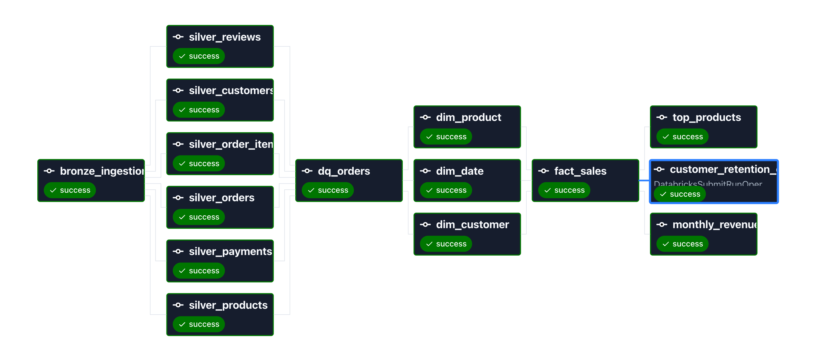

# E-Commerce Lakehouse Pipeline 📊

> An end-to-end **ELT pipeline** on the **medallion architecture** (Bronze → Silver → Gold), built on Databricks + Delta Lake using the public Olist Brazilian e-commerce dataset. Kimball star schema, **SCD Type 2** history tracking, **idempotent MERGE** loads, SQL analytics, inline data-quality checks, and **orchestrated end-to-end with Airflow in Docker**.


## Architecture




---

## Overview

Raw Olist CSVs are ingested, cleaned through layered transformations, modeled into an analytics-ready star schema, and orchestrated end-to-end with Airflow — with production-minded depth on the pieces that matter most: **SCD Type 2** dimensions, **idempotent MERGE** loads, and a **14-task DAG** that treats Databricks as a compute engine.

- **Bronze** — raw CSVs landed into Delta as-is, with lineage columns (`_load_timestamp`, `_source_file`). Schema-on-read, append-only.
- **Silver** — deduplicated on primary keys via window functions, type-cast, nulls handled, referential integrity validated.
- **Gold** — Kimball star schema: **FactSales** (grain: one row per order item) + **DimCustomer** (SCD2), **DimProduct**, **DimDate**. Loaded via idempotent MERGE.
- **Orchestration** — local Airflow (Docker) triggers Databricks serverless jobs via `DatabricksSubmitRunOperator`. Airflow owns the graph, retries, and scheduling; Databricks owns compute.

> A end to end production grade project on the public [Olist dataset](https://www.kaggle.com/datasets/olistbr/brazilian-ecommerce), for learning and demonstration.

---

## Tech Stack

**Airflow 3 · Docker · Databricks · Delta Lake · PySpark · SQL · Python** — Kimball star schema, SCD Type 2, `assert`-based data quality, 14-task orchestrated DAG on serverless compute.

---

## Business Questions

Three documented SQL analytics on the Gold layer: **monthly revenue trend**, **top products**, and a **customer retention cohort**.

> **Key finding:** Olist has strikingly low repeat-purchase retention — most customers buy once and never return, and the rare repeat buyers come back at long, irregular intervals.

---

## Engineering Decisions

The reasoning behind the build — the decisions I can defend in an interview.

### Data modeling

- **ELT, not ETL** — raw lands in Bronze first; transforms happen in-place. The medallion pattern is inherently ELT.
- **Fact grain = one order item** — set by the most granular question (product-level analytics); order-level grain can't attribute per-product revenue.
- **Per-order vs. per-person key** — Olist issues a new `customer_id` per order, so SCD2 and retention key on the stable `customer_unique_id`; a bridge (`customer_id → customer_unique_id → customer_sk`) links orders to the dimension at fact-build time.
- **SCD Type 2 on DimCustomer** — expire-and-insert via MERGE preserves point-in-time history, so facts join to the customer version valid when the sale occurred. Surrogate key via Delta `GENERATED ALWAYS AS IDENTITY`.
- **Idempotent MERGE** — FactSales upserts on the business key (`order_id + order_item_id`), not append, so reruns produce identical counts — safe to schedule.
- **Sales-fact scoping** — `order_status` carried as a degenerate dimension; revenue queries filter to `delivered` (fix after finding canceled-order revenue in the fact).
- **Current-only join** — on a historical backfill every customer has one version, so current *is* correct; point-in-time machinery retained for post-go-live changes.

### Orchestration

- **Airflow orchestrates, Databricks computes** — the DAG defines the graph; every task is a `DatabricksSubmitRunOperator` call to Databricks' REST API. Airflow itself never touches data.
- **`DatabricksSubmitRunOperator` over `RunNowOperator`** — the DAG is the single source of truth for what runs. Clone the repo, connect to any workspace, it runs. `RunNow` would split ownership between Airflow and Databricks.
- **Serverless compute, multi-task shape** — Databricks Free Edition is serverless-only; the DAG uses the multi-task `tasks=[]` payload (required — the single-task shape returns 400 without a cluster spec). At paid scale, classic job clusters would still win for pinned runtimes and Spark tuning.
- **One compute type** — analytics originally planned on SQL Warehouse via `.dbquery.ipynb`; migrated to `%sql`-in-notebook on serverless after hitting a Jobs API constraint (those files aren't a supported task type). Unified compute is cleaner at portfolio scale.
- **`cross_downstream` + `chain`** — full cross-product at the bronze→silver fan-out, elementwise `chain()` everywhere else. Two primitives, correct graph, no `list >> list` errors.
- **Custom Dockerfile, pinned provider** — Databricks provider (`apache-airflow-providers-databricks==7.16.1`) baked into an extended image. `_PIP_ADDITIONAL_REQUIREMENTS` would reinstall on every startup and drift silently.
- **Airflow Connections with Fernet** — PAT stored encrypted in the metadata DB. Same `conn_id` works with any secrets backend (Vault, AWS Secrets Manager); DAG code has zero secrets.
- **`catchup=False` + `max_active_runs=1`** — no accidental backfill flood on unpause; no overlapping runs stepping on each other's MERGE loads.

---

## Data Quality

Inline `assert`-based checks on Silver — fail-loud, so bad data stops the run: **row counts > 0**, **composite PK uniqueness** `(order_id, order_item_id)`, **no null keys**, and **referential integrity** via a null-safe left-anti join.

---

## Project Structure

```
ecommerce-lakehouse-pipeline/
├── ingestion/                      # Bronze — raw ingestion
├── transformations/
│   ├── silver/                     # cleaning & conforming
│   └── gold/                       # dims + fact_sales (SCD2, MERGE)
├── sql/                            # 3 analytics queries (%sql in notebooks)
├── tests/                          # data-quality assertions
├── airflow/                        # local Airflow orchestration
│   ├── docker-compose.yaml         # LocalExecutor + Postgres + custom image
│   ├── Dockerfile                  # extends apache/airflow:3.3.0
│   ├── requirements.txt            # pinned Databricks provider
│   └── dags/
│       ├── e_commerce_pipeline.py  # the 14-task DAG
│       ├── common/                 # helper factory (DatabricksSubmitRun)
│       └── config/                 # workspace paths + IDs
└── docs/                           # architecture diagram + Airflow setup PDF
```

Code files are not Delta tables — tables live in `bronze`/`silver`/`gold` schemas in Databricks.

---

## How to Run

### Manual (Databricks notebooks only)

1. Upload the [Olist dataset](https://www.kaggle.com/datasets/olistbr/brazilian-ecommerce) to a Databricks Volume; create `bronze` / `silver` / `gold` schemas.
2. Run in order: **ingestion → silver → gold** (dims first, then FactSales) → **data-quality checks → analytics**.
3. **Idempotency proof:** re-run the FactSales MERGE — row counts stay stable.

### Orchestrated (full pipeline via Airflow)

Detailed walkthrough in [`docs/Databricks_connection_with_Airflow.pdf`](docs/Databricks_connection_with_Airflow.pdf).

```bash
cd airflow/
# 1. .env with FERNET_KEY (see docs), AIRFLOW_UID, LOAD_EXAMPLES=false
docker compose build
docker compose up airflow-init
docker compose up -d
```

Then in the Airflow UI (`http://localhost:8080`, login `airflow` / `airflow`):

1. **Admin → Connections** → create `databricks_default` (type Databricks, host = workspace URL, password = PAT).
2. Unpause `ecommerce_lakehouse_elt_pipeline` and **▶ Trigger DAG**.
3. All 14 tasks run on Databricks serverless. Watch the Graph view fill green.


---

*Built by [Minhazul Islam](http://www.linkedin.com/in/minhaz74692) while transitioning into data engineering.*